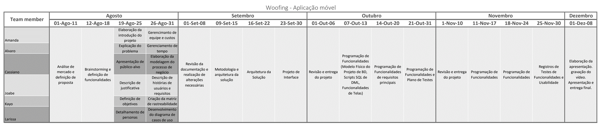

# Especificações do Projeto

A definição exata do problema e os pontos mais relevantes a serem tratados neste projeto foram consolidados por meio de pesquisa de mercado e entrevistas com hotéis de pets. Os detalhes levantados nesse processo foram consolidados em forma de personas e histórias de usuários.

## Personas

**Cliente**

Nome: Marina Costa

Idade: 32 anos

Ocupação: Analista de Marketing Digital

Perfil: Marina é uma profissional ocupada que divide seu tempo entre o trabalho e suas atividades pessoais. Ela tem um cachorro chamado Max, que considera parte da família. Marina valoriza a praticidade e a agilidade ao lidar com tarefas do dia a dia. Prefere realizar reservas online para a estadia de seu cachorro de forma rápida, sem precisar fazer diversas ligações ou enviar múltiplos e-mails. Gosta de utilizar ferramentas digitais que facilitem sua vida e lhe permitam economizar tempo.

Objetivo: Realizar a reserva para a estadia de seu cachorro em um hotel pet confiável, de maneira prática e rápida, utilizando o sistema.

**Administrador**

Nome: Carlos Menezes

Idade: 25 anos

Ocupação: Gerente de Operações de Sistemas

Perfil: Carlos é responsável por garantir a qualidade dos serviços oferecidos na plataforma. Ele é detalhista e valoriza a credibilidade e a segurança das informações. Sua principal preocupação é assegurar que os hotéis pet cadastrados no sistema sejam de confiança e ofereçam um serviço de qualidade aos usuários. Carlos revisa as informações dos hotéis com rigor e tem a missão de manter a plataforma como um ambiente seguro e confiável para os usuários.

Objetivo: Analisar e validar os hotéis cadastrados para garantir que todos os estabelecimentos disponíveis no sistema tenham credibilidade e ofereçam serviços de alta qualidade.

**Proprietária de Hotel**

Nome: Daniela Oliveira

Idade: 53 anos

Ocupação: Proprietária de um Hotel

Perfil: Daniela é empreendedora e possui um hotel pet em uma área movimentada da cidade. Ela é apaixonada por animais e tem como missão oferecer o melhor cuidado possível para os pets que ficam hospedados em seu hotel. Daniela busca constantemente novas formas de divulgar seu negócio para atrair mais clientes e maximizar seus lucros. Ela utiliza o aplicativo de reservas online como uma ferramenta para aumentar a visibilidade de seu hotel e facilitar o processo de reservas para os clientes.

Objetivo: Divulgar os serviços do seu hotel pet para atrair mais clientes e maximizar os lucros do seu negócio.

## Histórias de Usuários

Com base na análise das personas forma identificadas as seguintes histórias de usuários:

| EU COMO... `PERSONA`            | QUERO/PRECISO ... `FUNCIONALIDADE`                                                                 | PARA ... `MOTIVO/VALOR`                                                                                              |
|--------------------------------|----------------------------------------------------------------------------------------------------|-----------------------------------------------------------------------------------------------------------------------|
| **Cliente**                    | Desejo realizar reserva para estadia do meu animal de forma prática e rápida, sem a necessidade de ligar para diversos hotéis ou enviar diversos emails.           | Realizando desta forma é mais cômodo, economizando tempo e agilizando esta tarefa.              |
| **Cliente**                    | Quero me cadastrar no aplicativo, informando meus dados pessoais e os detalhes dos meus animais.   | Para que eu possa utilizar os serviços do aplicativo, como agendar estadias para meus pets de forma personalizada.    |
| **Cliente**                    | Quero agendar estadias para meus cães e gatos em um hotel de minha escolha e confirmar as datas.   | Para garantir que meus animais tenham um lugar seguro para ficar quando necessário.                                   |
| **Cliente**                    | Quero receber notificações de lembretes de check-in/check-out.       | Para me manter informado sobre o status das minhas reservas, evitando esquecimentos ou problemas.                     |
| **Cliente**                    | Quero acessar um histórico detalhado das minhas reservas anteriores.                              | Para que eu possa revisar as minhas interações passadas com os hotéis e planejar futuras estadias.                    |
| **Cliente**                    | Quero solicitar suporte aos administradores do aplicativo quando necessário.                      | Para resolver qualquer problema ou dúvida que eu tenha ao usar o aplicativo.                                          |
| **Cliente**                    | Quero poder atualizar meus dados pessoais e gerenciar as informações dos meus animais de estimação. | Para manter minhas informações sempre atualizadas e garantir que as reservas sejam feitas corretamente.               |
| **Cliente**                    | Quero avaliar meu atendimento no ultimo hotel que hospedei meu gato. | Para expressar meu nivel de satisfação com o serviço prestado               |
| **Hotel**                      | Quero ser notificado sobre novas reservas, alterações ou cancelamentos.                           | Para que eu possa gerenciar eficientemente as reservas e planejar a ocupação do hotel.                                |
| **Hotel**                      | Desejo me cadastrar e divulgar as acomodações do meu estabelecimento                 | Para ter mais visibilidade e maximizar os lucros do meu negócio.    |
| **Hotel**                      | Quero cadastrar meu hotel no aplicativo, fornecendo informações sobre meu estabelecimento e serviços. | Para que eu possa receber reservas de clientes que desejam hospedar seus animais no meu hotel.                        |
| **Hotel**                      | Quero visualizar as reservas realizadas no meu estabelecimento com todas as informações necessárias. | Para que eu possa organizar as acomodações dos animais e garantir uma boa experiência aos clientes.                   |
| **Hotel**                      | Quero ter a possibilidade de cancelar reservas feitas no meu hotel.                               | Para que eu possa gerenciar a ocupação do hotel em situações excepcionais, como emergências ou overbooking.           |
| **Hotel**                      | Quero visualizar solicitações de suporte feitas pelos clientes com todos os dados de contato e a descrição do problema. | Para que eu possa resolver problemas diretamente com os clientes e melhorar o serviço prestado.                        |
| **Administrador**              | Desejo analisar e aprovar os hotéis cadastrados no sistema.                 | Desta forma, os hotéis disponibilizados para reserva  terão credibilidade para o cliente |
| **Administrador**              | Preciso que o sistema gere um usuário e senha para mim ao ser criado.                             | Para que eu possa acessar o sistema e iniciar a gestão dos usuários e cadastros de forma segura.                      |
| **Administrador**              | Quero criar novos usuários administradores.                                                       | Para distribuir a responsabilidade de gerenciamento e permitir que outros administradores ajudem na gestão do sistema.|
| **Administrador**              | Quero aprovar cadastros de hotéis no aplicativo.                                                  | Para garantir que apenas hotéis confiáveis e de qualidade estejam disponíveis para os clientes.                       |
| **Todos os usuários** | Quero fazer login no aplicativo usando minhas credenciais específicas.                             | Para acessar as funcionalidades que são relevantes ao meu perfil de usuário, facilitando o uso do sistema.            |
| **Todos os usuários**          | Quero ter a possibilidade de alterar minha senha.                                                 | Para garantir a segurança da minha conta, permitindo ajustes em caso de suspeita de violação ou esquecimento.         |

## Modelagem do Processo de Negócio 

### Análise da Situação Atual

Atualmente, a reserva de hospedagens para pets em hotéis é realizada por meio de mensagens via whatsapp, instagram, sites ou visitas pessoais aos estabelecimentos. Este processo é ineficiente, pois:

Falta de centralização: Não há uma plataforma única para buscar e comparar hotéis para pets.
Informação Fragmentada: Donos de pets precisam entrar em contato com múltiplos hotéis para obter informações e verificar disponibilidade.
Dificuldade de Gestão: Hotéis enfrentam desafios em gerenciar reservas, especialmente com falta de visibilidade e processos de reserva manualmente intensivos. 

### Descrição Geral da Proposta

Desenvolver um aplicativo móvel que centraliza a busca, reserva e auxilia na gestão de hospedagens para pets em hotéis especializados. O aplicativo visa:

Centralizar Informações: Oferecer uma plataforma onde donos de pets podem pesquisar, comparar e reservar hotéis de forma rápida e conveniente.
Garantir Qualidade: Certificar que todos os hotéis cadastrados atendem a padrões rigorosos de qualidade.
Facilitar Gestão: Fornecer ferramentas para hotéis gerenciarem reservas e se comunicarem com os clientes de forma eficiente.
Aumentar Visibilidade: Ajudar hotéis a divulgar seus serviços e atrair novos clientes.

### Processo 1 – CADASTRO E APROVAÇÃO DE HOTÉIS

Implementação do processo de cadastro e aprovação para melhorar a eficiência e assegurar a credibilidade dos hotéis dentro da plataforma.

### Processo 2 – RESERVA DE ESTADIA

Melhorar a interface para tornar o processo de reserva ainda mais intuitivo. Implementando notificações mais detalhadas e em tempo real para todas as partes envolvidas a fim de garantir uma melhor acompanhamento dos agendamentos.

## Indicadores de Desempenho

| Indicador                          | Objetivos                                    | Descrição                                                    | Cálculo                            | Fonte de Dados                           | Perspectiva          |
|------------------------------------|----------------------------------------------|--------------------------------------------------------------|------------------------------------|------------------------------------------|----------------------|
| **Número de Hotéis Cadastrados**   | Ter pelo menos 100 hotéis cadastrados no primeiro ano | Total de hotéis cadastrados na plataforma                     | Contagem total de hotéis cadastrados | Tabela de Hotéis              | Crescimento          |
| **Tempo Médio de Aprovação de Hotel** | Aprovar solicitações em até 48 horas          | Tempo médio desde o envio da solicitação até a aprovação      | (Soma dos tempos de aprovação) / (número de solicitações aprovadas) | Tabela de Hotéis | Eficiência Operacional|
| **Número de Reservas Concluídas**  | Ter no mínimo 50 reservas realizadas no primeiro trimestre de execução da aplicação           | Total de reservas realizadas através da plataforma            | Contagem de reservas desde a data da implantação | Tabela de Reservas                        | Crescimento          |
| **Tempo Médio de Resolução de Suporte** | Resolver solicitações de suporte em até 24 horas | Tempo médio para resolver solicitações de suporte             | (Soma dos tempos de resolução) / (número de solicitações resolvidas) | Tabela de Solicitações            | Eficiência Operacional|
**Avaliação de Tutores (Nível de Satisfação)**  | Obter uma média de avaliação superior a 4,5  | Satisfação dos clientes (tutores) com o serviço dos hotéis  | Média das avaliações dos tutores  | Tabela de Avaliações  | Satisfação do Cliente

## Requisitos

As tabelas que se seguem apresentam os requisitos funcionais e não funcionais que detalham o escopo do projeto. Para determinar a prioridade de requisitos, aplicar uma técnica de priorização de requisitos e detalhar como a técnica foi aplicada.

### Requisitos Funcionais

|ID    | Descrição do Requisito  | Prioridade |
|------|-----------------------------------------|----|
|RF-01| Permitir que clientes, hotéis e administradores se cadastrem com informações essenciais, como dados pessoais, detalhes dos animais (cães e gatos) e informações sobre o estabelecimento. | ALTA | 
|RF-02| Permitir que cada tipo de usuário realize login com suas credenciais e acesse funcionalidades específicas para seu perfil.  | ALTA |
|RF-03| Possibilitar que clientes agendem estadias para seus cães e gatos, selecionando um hotel e confirmando as datas. | ALTA |
|RF-04| Enviar notificações para clientes e hotéis. Clientes receberão informações sobre confirmações de reservas e lembretes de check-in/check-out, enquanto hotéis serão notificados sobre novas reservas, alterações ou cancelamentos.  | ALTA |
|RF-05| Permitir que clientes acessem um histórico detalhado de suas reservas  | MÉDIA |
|RF-06| Possibilitar que o cliente faça solicitações de suporte aos administradores | BAIXA |
|RF-07| Viabilizar que os hotéis vejam os locais reservados e informações da reserva. | ALTA |
|RF-08| Proporcionar que os hotéis façam cancelamento de reservas. | ALTA |
|RF-09| Permitir que os administradores visualizem solicitações de suporte com os dados de contato do solicitante e a descrição do problema | BAIXA |
|RF-10| Gerar um usuário e senha para o primeiro administrador | ALTA |
|RF-11| Possibilitar que o administrador gerado por ela crie novos usuários administradores. | MÉDIA |
|RF-12| Viabilizar que o administrador faça a aprovação do cadastro de hotéis. | ALTA |
|RF-13| Facilitar que clientes atualizem seus dados, assim como adicionar e remover animais de estimação. | ALTA |
|RF-14| Permitir que todos os perfis de usuário alterem sua senha. | ALTA |
|RF-15| Permitir que clientes avaliem hotéis de 1 a 5. | MEDIA |

### Requisitos não Funcionais

|ID     | Descrição do Requisito  |Prioridade |
|-------|-------------------------|----|
|RNF-001| Ser responsivo e compátivel com diversos tamanhos de tela | MÉDIA | 
|RNF-002| Processar requisições do usuário em no máximo 3s | BAIXA |
|RNF-003| Ser utilizado React Native para desenvolvimento do aplicativo | ALTA |
|RNF-004| Operar 24 horas por dia e 7 dias por semana | MEDIA |
|RNF-005| Utilizar, necessariamente, o login para as atividades principais dentro do aplicativo | ALTA |

## Restrições

O projeto está restrito pelos itens apresentados na tabela a seguir.

|ID| Restrição                                             |
|--|-------------------------------------------------------|
|01| O projeto deverá ser entregue até o final do semestre |
|02| Não deve haver custo em plataformas durante o deploy do aplicativo.        |

## Diagrama de Casos de Uso

# Matriz de Rastreabilidade 

|Requisito| Objetivo de Negócio	                                | Caso de Uso | Caso de Teste | Módulo/Componente	 | Status | Dependências | 
|--|-------------------------------------------------------|------------|---------------------|--------------------|--------|----------------|
|RF-01| Cadastro de usuários	 | X | CT-01, CT-02 | Módulo de Cadastro | Não iniciado | - |
|RF-02	| Controle de acesso	 | X | CT-03, CT-04 | Módulo de Autenticação | Não iniciado | RF-01 |
|RF-03	| Agendamento de estadias		 | X | CT-05 | Módulo de Reservas | Não iniciado | RF-01, RF-02 |
|RF-04	| Comunicação com usuários	 | X | CT-06, CT-07 | Módulo de Notificaçõeso | Não iniciado | RF-03 |
|RF-05	| Histórico de reservas	 | X | CT-08 | Módulo de Histórico | Não iniciado | RF-03 |
|RF-06	| Suporte ao cliente	 | X | CT-09 | Módulo de Suporte | Não iniciado | RF-01 |
|RF-07	| Visualização de reservas	 | X | CT-10 | Módulo de Reservas | Não iniciado |  RF-03 |
|RF-08	| Cancelamento de reservas	 | X | CT-11 | Módulo de Reservas | Não iniciado |  RF-03 |
|RF-09	| Suporte aos hotéis	 | X | CT-12 | Módulo de Suporte | Não iniciado |  RF-06 |
|RF-10	| Criação de primeiro administrador	 | X | CT-13 | Módulo de Administração | Não iniciado |  RF-01 |
|RF-11	| Gerenciamento de administradores	 | X | CT-14 | Módulo de Administração | Não iniciado |  RF-10 |
|RF-12	| Aprovação de cadastro de hotéis	 | X | CT-15 | Módulo de Administração | Não iniciado |  RF-01 |
|RF-13	| Atualização de dados dos clientes	 | X | CT-16 | Módulo de Cadastro | Não iniciado |  RF-01 |
|RF-14	| Alteração de senha	 | X | CT-17 | Módulo de Autenticação | Não iniciado |  RF-02 |
|RF-15	| Avaliação do hotel	 | X | CT-18 | Módulo de Avaliação | Não iniciado |  RF-02 |
|RNF-001 | Compatibilidade de telas | X | CT-18 | Frontend | Não iniciado | RF-01 |
|RNF-002 | Desempenho | X | CT-19 | Backend | Não iniciado | - |
|RNF-003 | Uso de tecnologia React Native | X | CT-20 | Frontend | Não iniciado | - |
|RNF-004 | Disponibilidade do sistema | X | CT-21 | Infraestrutura | Não iniciado | - |
|RNF-005 | Controle de acesso com login | X | CT-22 | Módulo de Autenticação | Não iniciado | RF-02 |

# Gerenciamento de Projeto

## Gerenciamento de Tempo

O projeto tem ao todo a duração de 129 dias, divididos em cinco etapas. Na Etapa 1 será realizada a concepção, proposta de solução e o início da elaboração do projeto. Na Etapa 2, será dada continuidade à elaboração do projeto e ao início do desenvolvimento da solução. A Etapa 3 será dedicada à continuidade do desenvolvimento da solução (Parte 1). A Etapa 4 seguirá com a segunda parte do desenvolvimento. Por fim, na Etapa 5, ocorrerão o diagnóstico, a entrega da solução e a apresentação final do projeto.

## Gerenciamento de Equipe

## Gestão de Orçamento

| Categoria          | Detalhamento                                                                 | Custo Total (6 meses) |
|--------------------|-------------------------------------------------------------------------------|-----------------------|
| **Recursos Humanos** | Quantidade de desenvolvedores: 6 Horas por semana: 40 Valor hora: R$25,00 | R$144.000,00          |
| **Hardware**        | 6 Notebooks, cada um custando até R$4.000                                    | R$24.000,00           |
| **Rede**            | Pacote de Internet de 500 Mega, até R$110/mês                                | R$660,00              |
| **TOTAL**           | -                                                                            | **R$168.660,00**       |

