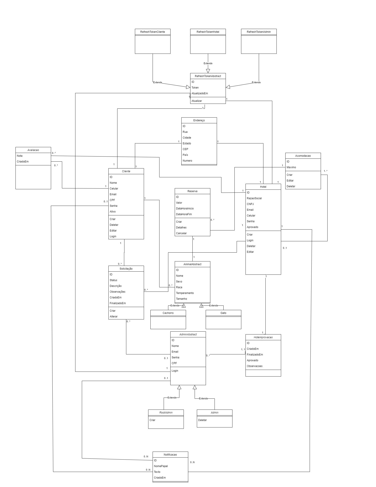
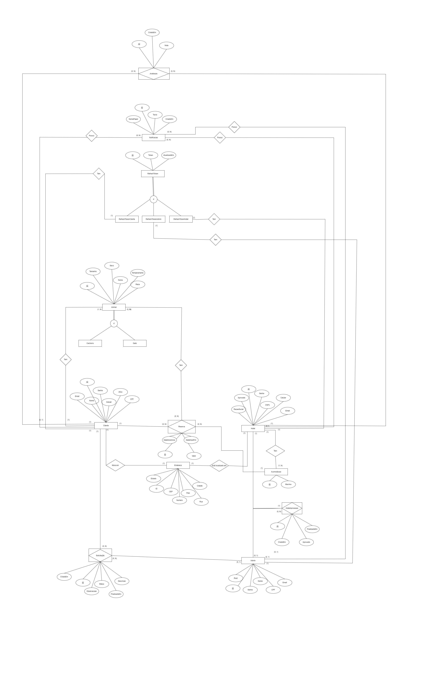
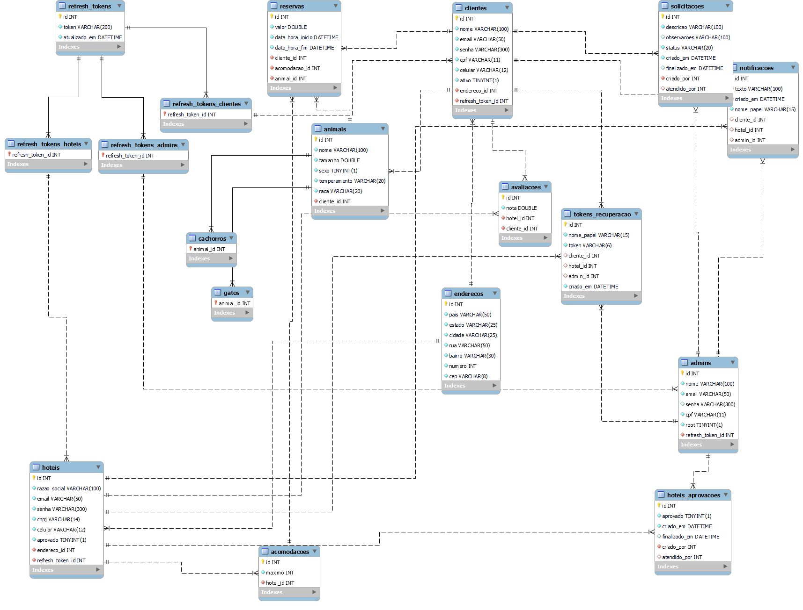

# Arquitetura da Solução

Pré-requisitos: <a href="3-Projeto de Interface.md"> Projeto de Interface</a>

Definição de como o software é estruturado em termos dos componentes que fazem parte da solução e do ambiente de hospedagem da aplicação.

## Diagrama de Classes

## Modelo ER

## Esquema Relacional

## Modelo Físico

[Modelo Físico](/src/bd/banco.sql)

## Tecnologias Utilizadas

- JavaScript
- React Native
- Node.js
- Express
- MySQL
- Sequelize
- Visual Studio Code
- Insomnia/Postman

Apresente também uma figura explicando como as tecnologias estão relacionadas ou como uma interação do usuário com o sistema vai ser conduzida, por onde ela passa até retornar uma resposta ao usuário.

## Hospedagem

Explique como a hospedagem e o lançamento da plataforma foi feita.

> **Links Úteis**:
>
> - [Website com GitHub Pages](https://pages.github.com/)
> - [Programação colaborativa com Repl.it](https://repl.it/)
> - [Getting Started with Heroku](https://devcenter.heroku.com/start)
> - [Publicando Seu Site No Heroku](http://pythonclub.com.br/publicando-seu-hello-world-no-heroku.html)

## Qualidade de Software

| Característica     | Subcaracterística   | Justificativa                                                                                             | Métrica |
| ------------------ | ------------------- | --------------------------------------------------------------------------------------------------------- | ------- |
| Funcionalidade     | Adequação           | Avalia se o aplicativo implementa corretamente as funcionalidades necessárias para atender aos requisitos dos usuários. | Percentual de funcionalidades implementadas conforme os requisitos. Exemplo: 1 - Menos de 60%, 3 - Entre 60% e 90%, 5 - Mais de 90%. |
| Confiabilidade     | Disponibilidade     | Mede o tempo em que o aplicativo está disponível e funcionando corretamente. | Tempo de uptime do app. Exemplo: 99% de disponibilidade durante um período de teste. |
| Usabilidade        | Facilidade de Uso       | Avalia a facilidade com que os usuários podem operar o aplicativo, garantindo uma boa experiência do usuário. | Taxa de sucesso dos usuários em completar tarefas sem assistência: 1 - Menos de 60%, 3 - Entre 60% e 90%, 5 - Mais de 90%. |
| Desempenho         | Tempo de resposta   | Verifica o tempo de resposta do aplicativo para ações do usuário.      | Tempo médio de resposta para operações principais: 1 - Menos de 2 segundos, 3 - Entre 2 e 4 segundos, 5 - Mais de 4 segundos. |
| Manutenibilidade   | Testabilidade       | Avalia a facilidade de testar o aplicativo após mudanças, assegurando que as modificações não introduzam novos erros. | Percentual de sucesso dos testes automatizados e manuais após mudanças no código: 1 - Menos de 60%, 3 - Entre 60% e 90%, 5 - Mais de 90%. |
| Segurança          | Confidencialidade   | Garante que os dados sensíveis dos usuários, como informações pessoais e credenciais, estejam protegidos. | Percentual de dados sensíveis criptografados ou protegidos: 1 - Menos de 60%, 3 - Entre 60% e 90%, 5 - Mais de 90%. |
| Portabilidade      | Adaptabilidade      | Avalia a capacidade do app de se adaptar a diferentes tamanhos de tela e versões de sistema operacional.    | Percentual de compatibilidade entre diferentes dispositivos (tamanhos de tela e versões de SO): 1 - Menos de 60%, 3 - Entre 60% e 90%, 5 - Mais de 90%. |
